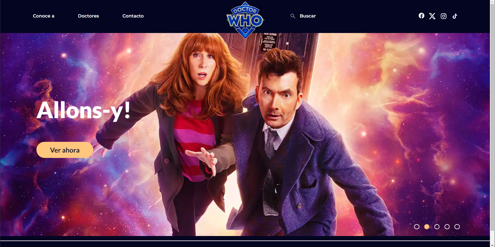
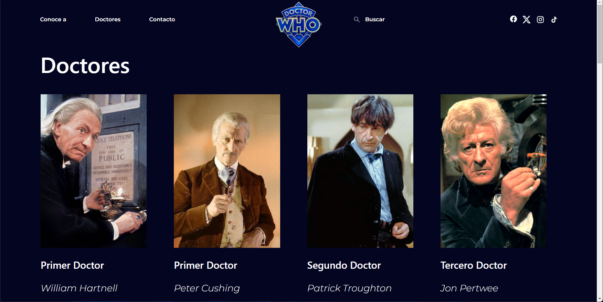
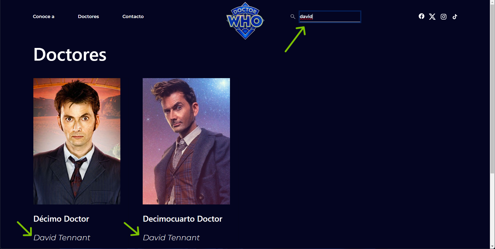
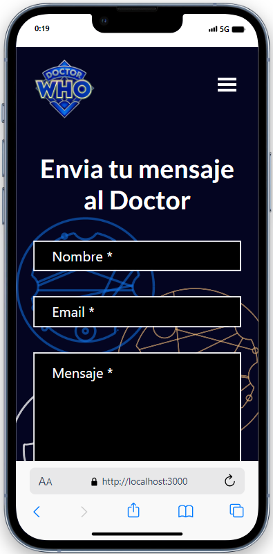
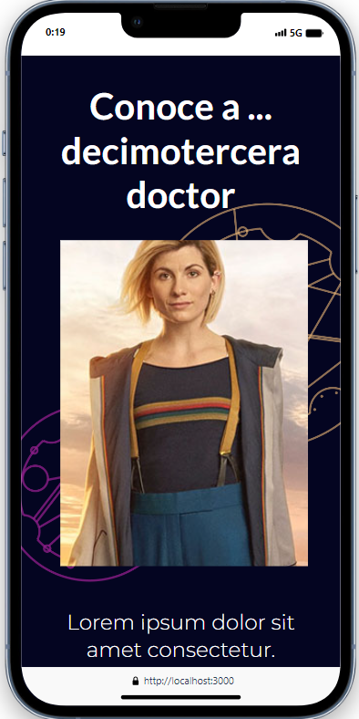
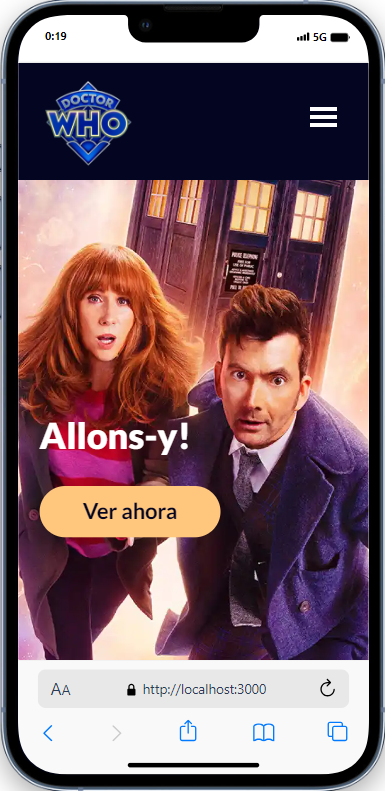

# Doctor Who React Web App

Welcome to this project which involved the website creation of famous science-fiction series Doctor Who, developed in React, ReactBootstrap, NextJS, and a bit of HTML/CSS. Enjoy!

## Table of Contents

- [Features](#features)
- [First Steps](#firststeps)
- [Images](#images)

## Features 

#### Landing Page
The website will display a landing page featuring a carousel. The carousel will showcase different titles from the series.

#### "Meet the../Conoce a.." Page
The website will display relevant information about the series characters.

#### "Doctors" Page
The website will display a list of doctors using a JSON file (with their data), and a card component. Clicking on "Read more" in the doctors' list will redirect to the link [https://www.doctorwho.tv/](https://www.doctorwho.tv/).

#### Search Feature/Header
The header will include a search bar that will filter the doctors' data, allowing users to search by name or type of doctor.

#### "Contact" Page
The website will feature a "Contact" page with a form. Upon completing the form and clicking "send," the information will be displayed in the console. On the web, an alert will appear indicating "Your message has been sent successfully."


## First Steps
1. Clone the repository.
```bash
https://github.com/dani-cp/doctorwho-react.git
```
2. Install React, ReactBootstrap, and NextJS dependencies.
```bash
npm install react react-bootstrap next
```
3. Run with 
```bash
npm run dev
```
4. Open [http://localhost:3000](http://localhost:3000) with your browser to see the result.

## Images
Here are some of the screenshots of this project:
<br><br>





   


<br><br>

Back to: [Table of Contents](#table-of-contents)